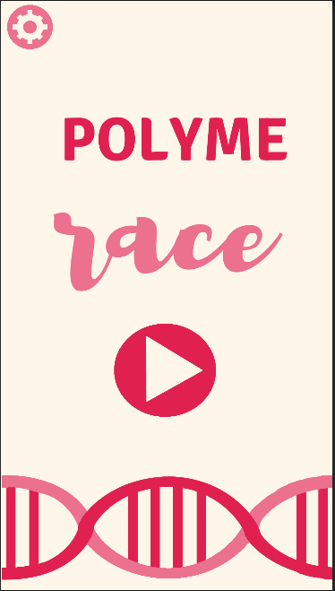
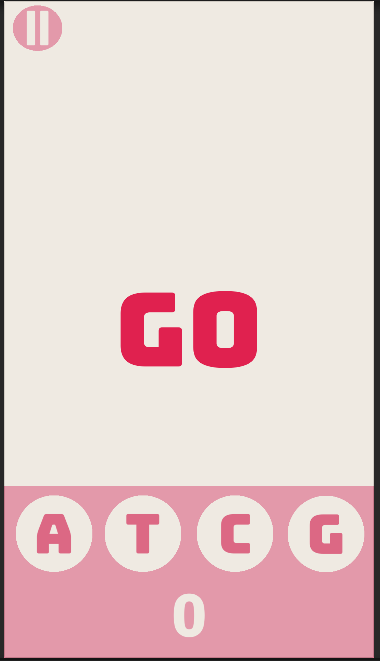
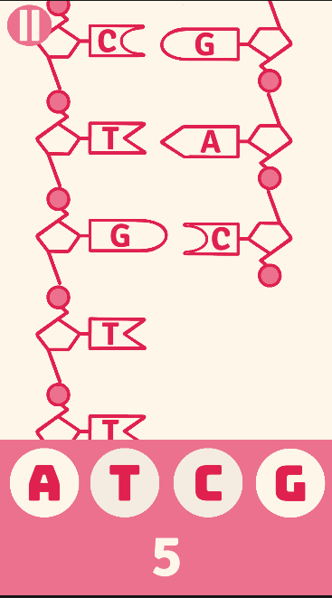
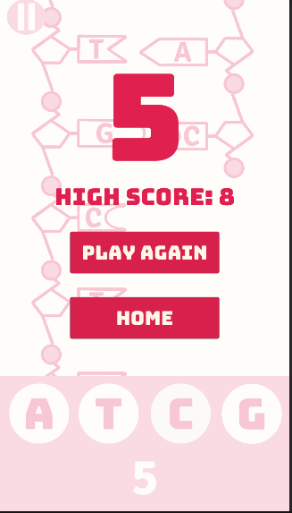

# DNA Polyme(RACE)

This game has users playing the part of DNA polymerase, matching DNA bases together. The goal is to increase your high score - racing against yourself, and in future versions, others. This game was built using Unity. Some of the assets (scripts, scenes, etc) are included here.

## Screenshots

Here are some screenshots of the game.

The starting page. 

The countdown. 

The main game. 

Game over. 

